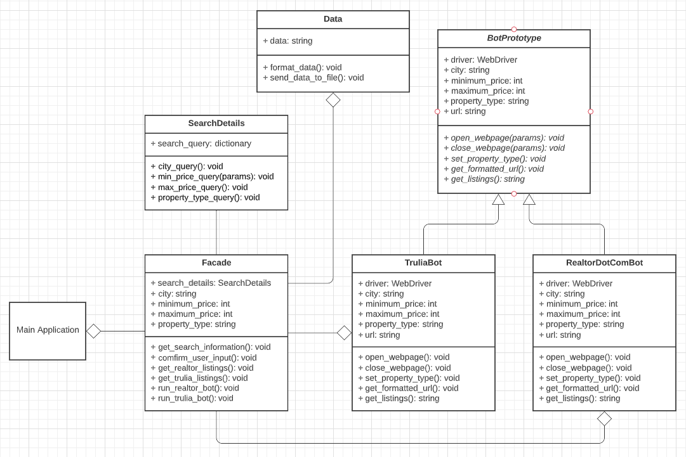

# RealEstateListingsBot

The objective of the project was to develop new a project to web-scrape real estate websites such as realtor.com and trulia.com 
and get data from these websites based on the user input provided. The code was written in Python and Selenium for web-scraping. 
In this project, I used the prototype design pattern to create bots that slightly differ per website. I also used the facade design 
pattern to hide complexity and to simplify the main function. 

## Class Diagram: 

