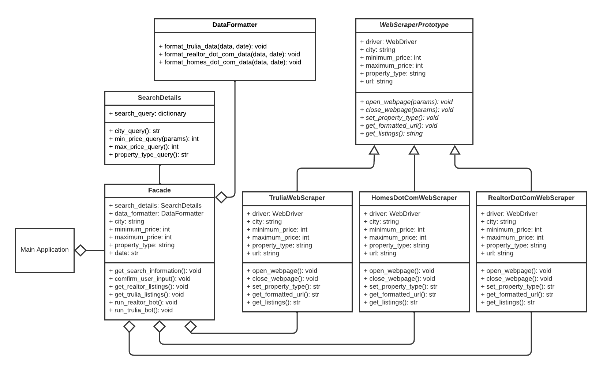

# Real Estate Listings Web Scraper

The objective of the project was to web-scrape real estate websites such as realtor.com and trulia.com and get listing data from these websites based on the user input provided. The code was written in Python along with Selenium.

In this project, I used the prototype design pattern to create scrapers that slightly differ per website. I also used the facade design pattern to hide complexity and simplify the main function.

## Class Diagram:

